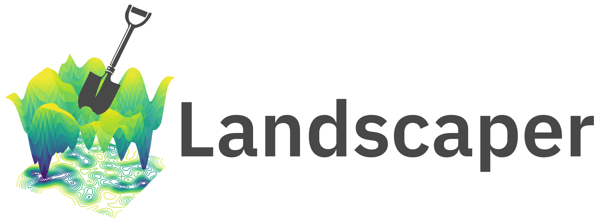

<div align="center">



### Landscaper enables the multi-dimensional analysis of machine learning loss landscapes. 

</div>

## Introduction

Landscaper offers a comprehensive framework for exploring the loss landscapes of deep learning models, encompassing three key aspects: **construction**, **quantification**, and **visualization**. It achieves this by **constructing** detailed landscape representations via high-dimensional sampling. Then, it **quantifies** them using methods like a novel TDA-based smoothness metric, offering new evaluation perspectives. Finally, Landscaper provides intuitive **visualization** tools to help users extract actionable insights, complementing traditional performance metrics for a more holistic understanding of model behavior.

## Setup
This package is managed by `uv`, you can find instructions on how to install it [here](https://github.com/astral-sh/uv). Once it is installed, simply run `uv venv` to setup your environment.

## BibTeX Citation 
```
@article{CITE_KEY,
  title = {Understanding 3D GNN Loss Landscapes through Topological Analysis: Insights from Olefin Hydroformylation},
  author = {Chen, Jiaqing and Hadler, Nicholas and Xie, Tiankai and Hnatyshyn, Rostyslav and Geniesse, Caleb and Perciano, Talita and Mahoney, Micheal W., and Hartwig, John F., and Maciejewski, Ross and Weber, Gunther H.},
  year = {2025},
  month = {},
  journal = {},
  volume = {},
  number = {},
  pages = {},
  publisher = {},
  issn = {},
  doi = {},
}
```
